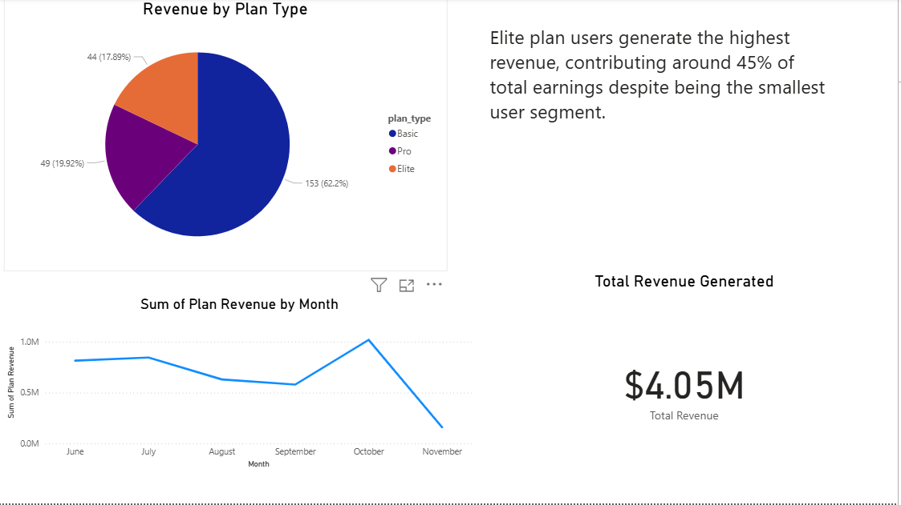

# PulseFit – Real User Monitoring & Analytics Dashboard

PulseFit is a simulated Real User Monitoring (RUM) platform designed to analyze user behavior, subscription performance, engagement patterns, and revenue insights.  
This project integrates **Python**, **Power BI**, and a **modern responsive website** built with HTML, CSS, JavaScript, and TailwindCSS.

The system generates **6,000 simulated RUM events**, analyzes them using **Power BI**, and visualizes insights directly on a custom analytics webpage.

---

##  Project Features

- **Python Data Generator (6,000+ realistic RUM events)**
- **CSV, JSON, and Excel support**
- **Interactive Power BI dashboards**
- **Subscription + Revenue analytics**
- **Engagement trend insights**
- **Clean analytics webpage to present insights**
- **TailwindCSS styling + Responsive Layout**
- **Image visualization and structured storytelling**
- **Unsplash-powered visuals**
- **Datadog-inspired event logic structure**

---

##  Technologies Used

### **Programming & Data**
- Python  
- Pandas  
- JSON  
- CSV  
- Excel  

### **Frontend**
- HTML  
- CSS  
- TailwindCSS  
- JavaScript  

### **Analytics & Visualization**
- Power BI Desktop  
- Power BI DAX (Measures & Calculated Columns)

### **Other Tools**
- Unsplash (images)  
- VS Code  
- Datadog (concept inspiration for RUM events)

---

## 📁 Project Structure

```plaintext
project-root/
│
├── data/
│   ├── rum_generated.csv
│   ├── rum_generated.json
│
├── scripts/
│   ├── rum_data_generator.py
│
├── website/
│   ├── index.html
│   ├── analytics.html
│   ├── subscriptions.html
│   ├── trainers.html
│   ├── contact.html
│   │
│   ├── css/
│   │   ├── style.css
│   │
│   ├── images/
│       ├── user-demograph.png
│       ├── subscription.png
│       ├── revenue.png
│       ├── engagement.png
│
└── README.md
 Data Generation (Python)
Run the Python script to generate your RUM dataset:

bash
Copy code
python scripts/rum_data_generator.py
This script will generate:

data/rum_generated.csv

data/rum_generated.json

Containing simulated user behavior such as:

Page visits

Session activity

Subscription actions

Plan upgrades

Engagement timestamps

 Power BI Workflow
Import rum_generated.csv into Power BI

Create transformation columns:

Month

Plan Revenue

Converted Status

Create measures:

Total Revenue

Total Users

Conversion Rate

Build visuals:

Bar chart (Users by Country)

Donut chart (Subscriptions by Plan)

Line graph (Revenue Trend by Month)

Card visuals

Export screenshots for your website analytics page.

🌐 Website Pages
✔ Home Page
A landing page introducing PulseFit.

✔ Plans Page
Displays available subscription tiers.

✔ Trainers Page
Workout trainers and fitness professionals.

✔ Analytics Page
A storytelling dashboard section displaying:

User Demographics

Engagement Behaviour

Conversion & Subscription Insights

Revenue & Profitability

Recommendations

Future Improvements

Each insight section contains:

Explanation text

Power BI image (screenshot)

Side-by-side layout

Professional storytelling

 Screenshots
(Add yours here when uploading to GitHub)

markdown
Copy code
### User Demographics  


### Engagement Behaviour  


### Subscription Analysis  


### Revenue Dashboard  

🌟 Key Insights From Data
Nigeria and South Africa are the top 2 markets

Elite plan generates ~50% of total revenue

Basic plan has the highest sign-ups but lower retention

Peak usage happens midday and early evening

Revenue shows a steady upward trend

🧭 Future Enhancements
Power BI automatic refresh

Add churn analysis

Integrate machine learning forecasting

Deploy analytics page with backend API

Live Datadog-style event streaming

📦 How to Run the Website Locally
bash
Copy code
cd website
Then open any page using Live Server (VS Code):

bash
Copy code
Right-click → Open with Live Server
OR manually:

pgsql
Copy code
Double-click index.html
🧑‍💻 Author
Elizabeth Ititi Ogbeh
Real User Monitoring & Analytics Portfolio Project
Built with guidance from ChatGPT

📜 License
This project is open-source and free to use.


